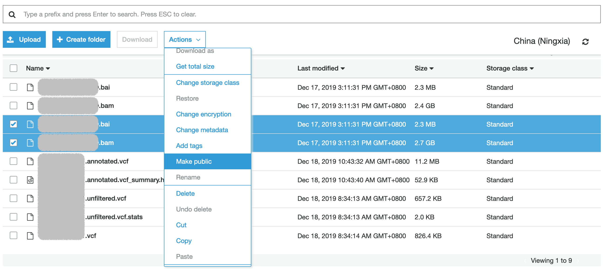
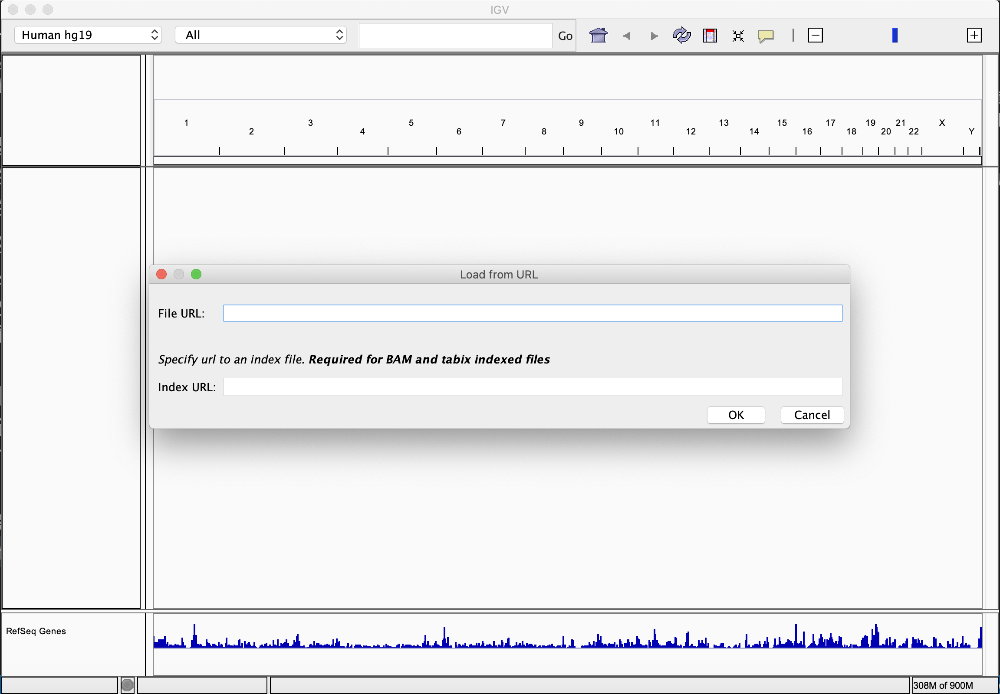

# BAM文件放云上好了，本地IGV很方便

## 平常怎么用IGV看基因组比对图？

相信对于做基因组变异分析的人来说，比对完基因组后用[IGV](http://software.broadinstitute.org/software/igv/)查看比对情况，以及肉眼确认[GATK](https://gatk.broadinstitute.org/hc/en-us)等软件分析出来的变异等工作再熟悉不过。

通常情况下，在以前没有适用云的时候，我是通过自己的电脑SSH登陆到公司的数据中心，一顿命令行操作将FQ文件分析成我想要的BAM，然后输入命令`java -jar -Xmx4g igv.jar`，电脑就会为我打开IGV的图形界面。

_当然，由于打开IGV的服务器是Linux系统，其使用的图形界面服务是X11，如果你是Windows操作系统，多半你需要安装[Xming](https://sourceforge.net/projects/xming)，如果是OSX操作系统，可能你需要安装[XQuartz](https://www.xquartz.org)。_

这样做一般来说是下意识就能想到的，我这么做了好多年。但有一些缺点：

1. 需要有一台服务器一直开着，就会有资源浪费的可能。对于有本地数据中心的来说也没什么，反正本来就会浪费的：）））但是对于使用云服务器的，这个开销还是挺可观的。

2. X11在Mac电脑OSX系统上的官方支持早已是过去式，通过XQuartz实现该功能显得过于繁琐。我最近一台新电脑升级了OSX 10.15之后耗费了我很长时间，最终我放弃了，因为我不想把我的电脑弄得很乱：）））

3. BAM文件一般都比较大，Panel的数据也要1GB多，全基因组要几十上百GB。这么大的文件放在存储服务器上，高速存储浪费资源，低俗存储反应又慢，对于维护而言的确比较麻烦。

## 文件存储为什么要放在云上？

当然，云不是万能的，也存在很多种情况本地数据中心更加高效节省。

对于生信界，目前我个人认为文件存储放在云上比较合适的，我的理由有以下几个：

1. 放心。别笑我，如果做好信息的隔离，云上的数据是 __相当__ 安全的。我们要强迫自己理性思维，比如你为什么觉得放在云上不安全。从数据隐私保护、可用性等方面来看，数字可以告诉我们大厂的云存储比绝大多数数据中心安装。

2. 省心。一般云服务提供商都提供了多种规格、适用多种应用场景的存储方案及价格，这样可以根据业务场景选择不同的存储级别。之前的文章[入门系列3 关于S3,EBS,EFS的三角关系](2020-01-26-s3-ebs-efs-compare.md)中以AWS S3为例列举了标准、非频繁访问、归档等多种存储方案及价格体系。

3. 贴心。AWS S3提供了众多权限管理、访问管理等功能，可以帮助我们设定不同数据的访问权限，以及在出问题的时候查找问题原因。

## IGV能打开存在S3上的BAM文件吗？

[IGV官方文档](http://software.broadinstitute.org/software/igv/LoadData)上说IGV可以载入数据的方式有本地文件、HTTP URL以及IGV数据服务器。

显然，IGV目前不支持S3的链接。但其实从S3的Web界面上可以轻松查到获取文件HTTP URL的方式，不知道的请转阅[此链接](https://docs.amazonaws.cn/AmazonS3/latest/user-guide/view-object-overview.html)中文件概述截图中的URL。

慢着，S3上的操作还差一步了，如果要从IGV访问还需要开放S3上对应文件的可读权限，如下图操作就可以了。

_上图：AWS S3中开放文件可读权限_

然后打开电脑上IGV，按照`File > Load from URL`依次点开菜单，在如下图的两个框中输入BAM文件以及对应BAI文件的URL就可以轻松查看比对信息人工确认变异了。

_上图：IGV中载入URL_

## 遗留问题

至此，本地打开S3上的BAM文件解决了，但还有以下几个问题没有在本文中介绍：

1. 这么大的文件从网络上下载，会不会特别慢啊？会不会流量费特别贵啊？

2. “Make public”，让该文件读取权限暴露在互联网中，任何拥有该权限的人都可以查看，这点肯定不对。

3. 对于FQ、BAM、VCF等不同类型文件的存储方案是什么？都放在标准存储中吗？

这几个问题我会在今后的文章中逐一解释。
