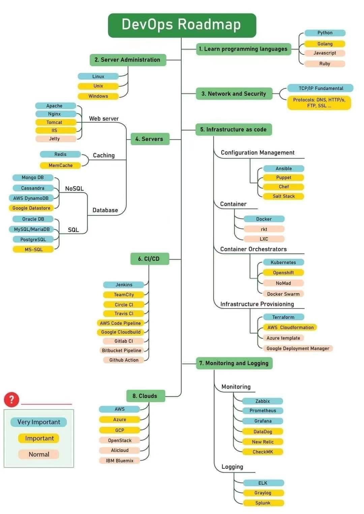

## 一图了解现代化开发运维DevOps

> .
>
> -- D.C

### 什么是DevOps?

随着软件发布迭代的频率越来越高，传统的「瀑布型」（开发—测试—发布）模式已经不能满足快速交付的需求。2009 年左右 DevOps 应运而生，简单地来说，就是更好的优化开发(DEV)、测试(QA)、运维(OPS)的流程，突出重视软件开发人员和运维人员的沟通合作来实现开发运维一体化，通过高度自动化工具与流程来使得软件构建、测试、发布更加快捷、频繁和可靠。

### DevOps 路线图

以下是DevOps的路线图，快看看自己到哪个段位了，另外AWS也有专门针对DevOps的培训，云端是DevOps最好的试验场!

相关工具大致有：

- 代码管理（SCM）：GitHub、GitLab、BitBucket、SubVersion

- 构建工具：Ant、Gradle、maven

- 自动部署：Capistrano、CodeDeploy

- 持续集成（CI）：Bamboo、Hudson、Jenkins

- 配置管理：Ansible、Chef、Puppet、SaltStack、ScriptRock GuardRail

- 容器：Docker、LXC、第三方厂商如AWS

- 编排：Kubernetes、Core、Apache Mesos、DC/OS

- 服务注册与发现：Zookeeper、etcd、Consul

- 脚本语言：python、ruby、shell

- 日志管理：ELK、Logentries

- 系统监控：Datadog、Graphite、Icinga、Nagios

- 性能监控：AppDynamics、New Relic、Splunk

- 压力测试：JMeter、Blaze Meter、loader.io

- 预警：PagerDuty、pingdom、厂商自带如AWS SNS

- HTTP加速器：Varnish

- 消息总线：ActiveMQ、SQS

- 应用服务器：Tomcat、JBoss

- Web服务器：Apache、Nginx、IIS

- 数据库：MySQL、Oracle、PostgreSQL等关系型数据库；cassandra、mongoDB、redis等NoSQL数据库

- 项目管理（PM）：Jira、Asana、Taiga、Trello、Basecamp、Pivotal Tracker