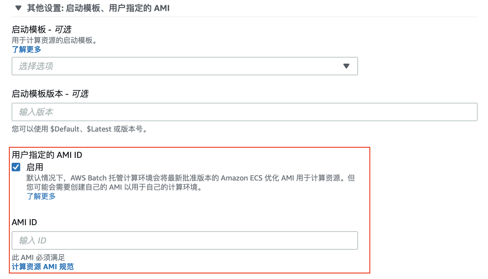

# 使用Batch服务一些提示

> 听说AWS和阿里云都有Batch（阿里云叫批量计算）服务，当时介绍说可以理解为云端PBS。
> 然后看了官方介绍视频，我理解更多的是任务切分和用适合的资源来进行调度。
> 当然，用这个服务还是有一些学习成本。
> -- Sam


### 介绍之前

AWS官方的Batch介绍和[文档](https://docs.amazonaws.cn/batch/latest/userguide/what-is-batch.html)是个很好的学习资源，另外Davis同学写的[容器！利器！批量计算AWS Batch](./2020-01-14-how-to-use-aws-batch-china.md)给生信人员举了很好的例子。

但文档是一回事，这篇文章简单介绍几个我使用Batch服务过程中学会的几个Tips。

### 计算环境配置

#### 尽量使用与你需要资源相对应的机型。

当初我配置了自动的机型，然后发现我一次性同时开了多个任务，比如每个任务我设定需要4 CPU，7G RAM，同时开4个样本的任务，很可能Batch会给我使用16 CPU的机器。这样倒也不是不行，但有几个问题需要注意：

    - 一台虚拟机执行多个任务的时候资源是共享的，比如我们做比对任务，你需要提起预估总共需要的存储空间；
    - 如果你配置了Docker服务运行时的挂载选项，那多个任务就会同时访问这个挂载点，需要对每个任务设定不同的工作目录。

我的做法是，如果任务需要4 CPU，7G RAM，那就选择c4.xlarge或者c5.xlarge机型，这样可以保证每个虚拟机只执行一个任务。

I know，我这么做挺小白的，BITE ME!

#### 自定义AMI

如果使用 __按需__ 的实例配置，当提交任务时Batch会默认为你开启一台你选定机型的EC2虚拟服务器，系统是AmazonLinux 2，硬盘大小为20 GB。对于NGS分析而言，这个硬盘大小肯定是不够的。

一般而言，主要有两种解决方法，配置外部存储或者调整虚拟机AMI。

对于配置外部存储而言，我尝试过使用[EFS](./2020-01-31-efs-user-guide-101.md)，但的确，我还不太适应，主要性能上我还不太会配置。

相对而言，调整虚拟机AMI是个简单的解决方法，具体步骤如下：

1. 首先你得制作一个AMI，参考[这篇文章](./2020-01-25-how-to-create-ec2img.md)即可。注意，这个时候你需要根据分析流程配置足够性能和足够空间的硬盘；
2. 请注意，自定义制作的AMI需要符合[这篇文章](https://docs.amazonaws.cn/batch/latest/userguide/create-batch-ami.html)的规范；
3. 在创建计算环境时，在 __实例配置__ 中选择 __按需__ 实例配置，点开下方 __其他设置：启动模板、用户指定的AMI__ 填入上一步制作的系统镜像ID。如下图所示。



---

### Docker镜像

#### 尽量使用Dockerfile

听起来像废话，但使用Dockerfile可以让镜像的制作可以追溯，像写代码一样制作镜像让我觉得非常有意思。

以下是我写的一个非常简单的让Docker拥有阿里云CLI功能的Dockerfile。

```Dockerfile
FROM amazonlinux:latest

RUN yum update -y
RUN yum install -y aws-cli wget tar util-linux python3

RUN mkdir -p /biosoftware
RUN mkdir -p /data
RUN cd /biosoftware && wget -O aliyun-cli-linux-latest-amd64.tgz https://aliyuncli.alicdn.com/aliyun-cli-linux-latest-amd64.tgz?spm=a2c4g.11186623.2.11.6a057dbflbfyNj\&file=aliyun-cli-linux-latest-amd64.tgz \
    && tar xzvf aliyun-cli-linux-latest-amd64.tgz && cp aliyun /usr/local/bin/

WORKDIR /data
```

#### 镜像瘦身

以上简单的镜像的大小约为900MB，加了一个简单的功能就需要这么大的空间，不可思议对吧？

别担心，这个镜像上传到AWS ECR之后大概变成400MB，我猜测引用镜像之类的AWS会自动判断出来不占用额外空间。

同时，使用Docker的[multi-stage builds]()技术可以减小镜像体积，以上示例可以修改为以下：

```Dockerfile
FROM amazonlinux:latest as build

RUN yum install -y aws-cli wget tar util-linux python3

RUN mkdir -p /biosoftware
RUN mkdir -p /data
RUN cd /biosoftware && wget -O aliyun-cli-linux-latest-amd64.tgz https://aliyuncli.alicdn.com/aliyun-cli-linux-latest-amd64.tgz?spm=a2c4g.11186623.2.11.6a057dbflbfyNj\&file=aliyun-cli-linux-latest-amd64.tgz \
    && tar xzvf aliyun-cli-linux-latest-amd64.tgz


FROM amazonlinux:latest as prod

RUN yum -y install aws-cli tar util-linux python3

RUN mkdir -p /biosoftware
COPY --from=build /biosoftware/aliyun /usr/local/bin/aliyun

WORKDIR /data
```

从下图可以直观看到镜像体积变化（`<untagged>`是瘦身后）。


关于镜像瘦身还有其他技术方式，比如使用体积更小alpine基础镜像等。

---

本次介绍先到这里，其他Tip会在本文中更新。
