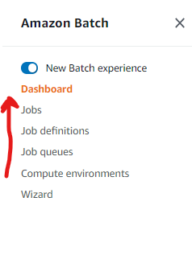
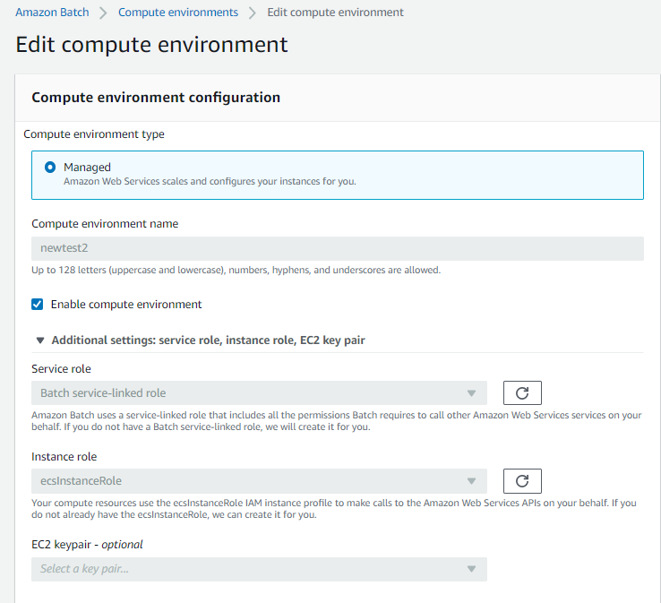
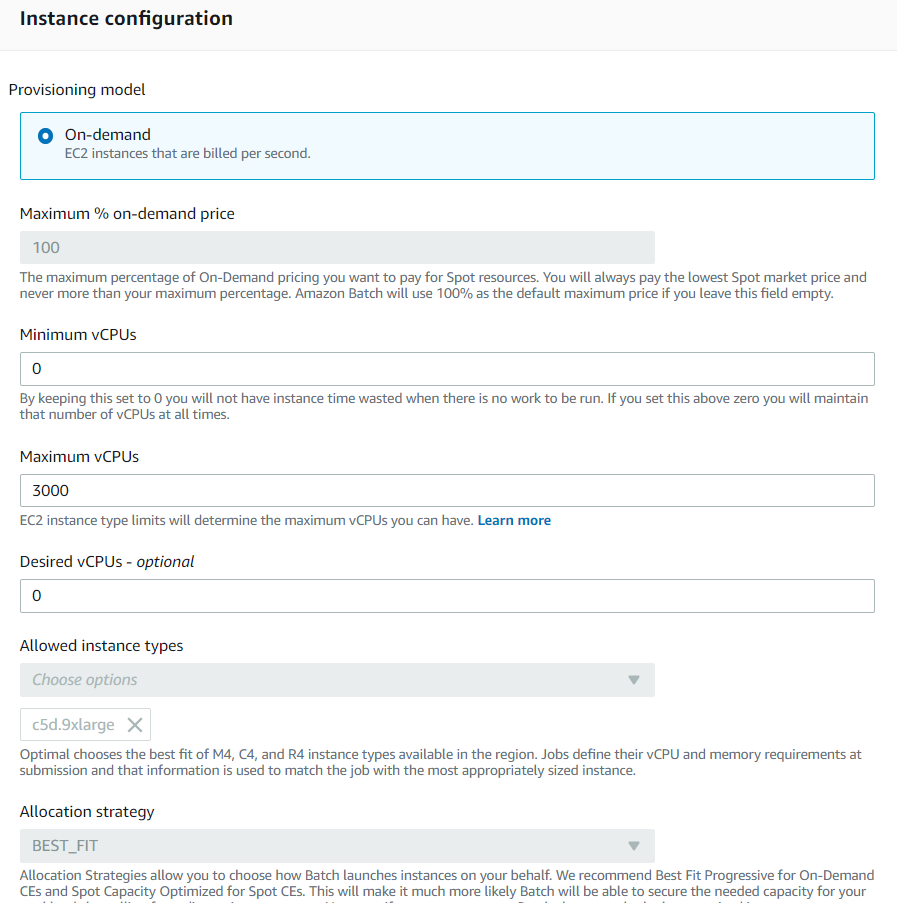
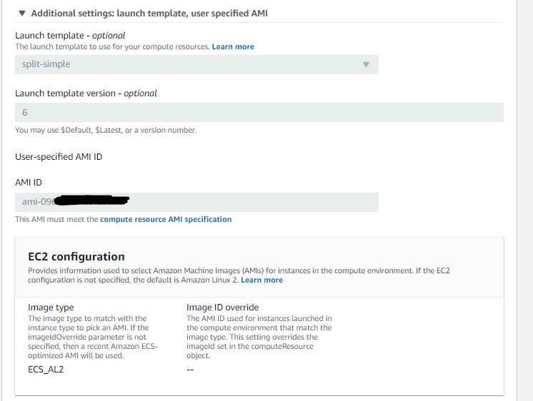
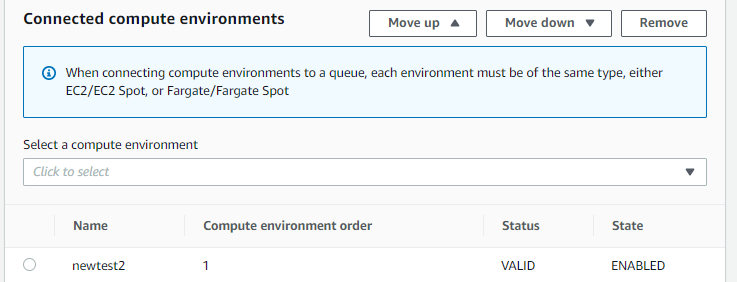
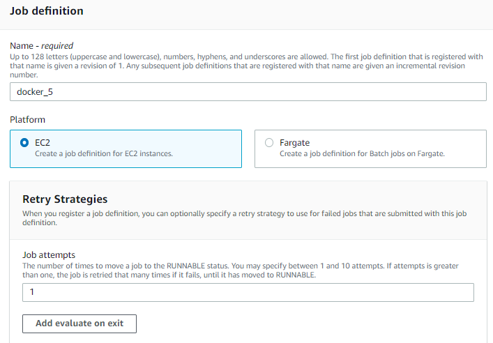
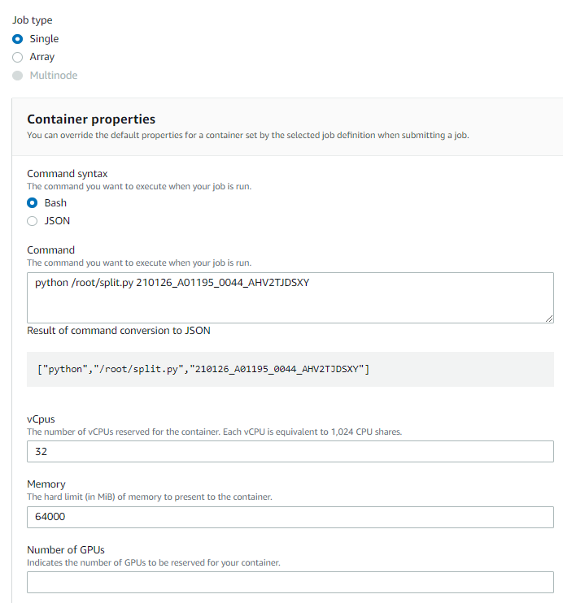

# 高阶17 云上自动拆分测序数据

> batch是个好东西，批量提交，算完就关机器（跑路），本文以一个基因公司的刚需（分拆数据）为例，
> 向各位看官介绍如何利用batch，ecs, ecr，lustre，启动模板，ami镜像来打造一个自动化的云上数据拆分流程。
> 当然，如果你能掌握本文的技巧，那么无疑打开了一扇大门。
> -- D.C


### 引子

本文会介绍到一些AWS的产品如下：

- batch 批量计算服务
- ECS 容器服务
- ECR 容器注册服务
- FSx for lustre  Nas服务
- S3  存储服务
- nvme  云端有些机型会自带物理盘，一般型号里面会带d，比如本文用到的机器 `c5d.9xlarge`,就自带一块900G的nvme磁盘

先说一个场景吧，实验室主管给我发了一个邮件，说明下机数据和对应的samplesheet都已经按我的要求上传到S3指定的位置，请求进行下一步的拆分和二级分析。

于是我根据邮件的内容，在自己笔记本上执行了一条命令，大致是这样的：

```python
for id in xxx:
  command = 'aws batch submit-job --job-name testcli --job-queue newsplit2  --job-definition docker_5 --container-overrides \'vcpus=32,memory=64000,command=["python","/root/split.py","%s"]\'' % id
  os.system(command)
  ...
```

于是是所有的样本就都开始在云端开始拆分，数据放到指定的nas上，并紧接着开始做二级分析出报告。看到这里估计很多人一脸懵，这很正常，如果你都看到了，那么就不要浪费时间再往下看了，饮茶先啦。

### 基本逻辑

还是先给大家梳理下基本思路吧：

- 首先用FSx for Lustre 创建一个NAS盘，用来存放拆分后的数据以及作为后续二级分析的input、中间文件和结果文件的临时存放地。
- 利用ECS优化过的ami镜像，安装必要的连接lustre的工具以及Nvme盘的工具，生成新的AMI镜像，洗净待用~
- 创建一个EC2的启动模板，利用里面的Userdata设置，可以让EC2启动的时候自动连接Lustre和自动挂载Nvme盘(实例自带的物理盘，IO很高，拆分速度快)。
- 新建一个容器，内部安装好miniconda和bcl2fastq，以及自己写的运行拆分的脚本，打成新的镜像，注册到ECR的库中，洗净待用~
- 配置Batch里面的 计算环境，任务队列，任务定义，这三项会用到以上步骤准备的前菜哦。
- 最后提交批量分析任务，enjoy code as infra的快感吧。

### 直奔主题

#### 创建FSx for lustre

在AWS console界面搜索 FSx，新建选择for lustre， 按照实际的吞吐需求选择对应的档位，有50M，100M,200M/TiB的，注意nas大小只能在1.2T开始往上加，每次加2.4T。如图可以看到，我配置了一块12T的lustre，吞吐达到了600M/s，这里需要把红圈点一下，复制下来他的id _fs-abcdefg_ 。

**注意**： Lustre在创建时会让你选择安全组，如果用系统默认的话不需要改动，因为是全开的，如果是换了别的安全组，需要确认 inbound 的 0-65535 端口是打开的。


#### 创建启动模板 Launch Template

登录EC2的界面，在左侧菜单栏点击Launch Template，进入设置。


在这一步，只需要做两步设置：

- 设定一个安全组，
- 在Advanced details里，设置User Data:

```
MIME-Version: 1.0
Content-Type: multipart/mixed; boundary="==BOUNDARY=="

--==BOUNDARY==
Content-Type: text/x-shellscript; charset="us-ascii"

#!/bin/bash
mkdir /fsx
mkdir /data
mount -t lustre -o noatime,flock fs-abcdef.fsx.cn-northwest-1.amazonaws.com@tcp:/zxktnbmv /fsx
file -s /dev/nvme1n1
mkfs -t xfs /dev/nvme1n1
mount /dev/nvme1n1 /data

--==BOUNDARY==--
```

**注意**： 这个Userdata里面设置的命令，会在EC2启动之后以root的身份执行，这样就自动附加了磁盘和NAS了。

设置完毕，会生成一个launch template，我们只需要记住它的name是 _split-simple_, 以及它的版本号 _6_ 。


#### 创建新AMI

进入EC2的界面，启动新实例，搜索并选择ECS优化过的AMI，宁夏区是 _ami-07ddef153d23fcb8a_, 其他区域的 [点我](https://docs.aws.amazon.com/AmazonECS/latest/developerguide/ecs-optimized_AMI.html)。

机型随意选择，我默认选了 _t2.micro_, 启动以后登录进去，做两件事：

- iam权限要能访问S3 （界面设置）
- 安装lustre驱动
- 安装xfsprogs

第二三步命令如下：

```bash
sudo amazon-linux-extras install -y lustre2.10
sudo mkdir -p /fsx
sudo mount -t lustre -o noatime,flock fs-abcdef.fsx.cn-northwest-1.amazonaws.com@tcp:/zxktnbmv /fsx
sudo mkdir /fsx/fastq
sudo mkdir /fsx/splited
sudo yum -y install xfsprogs
```

**注意**： 这里mount到lustre是为了创建文件夹fastq和splited，同时为后面提交任务后查看是否有输出预留一个途径。

做完这些事儿以后，将这台机器打个新的AMI镜像为 _ami-123456789_, 聪明的小伙伴可能就想到了，这个新AMI起来的机器，再搭配上上一步设置的 启动模板，就能做到启动后自动挂载lustre和nvme磁盘了。

#### 创建新容器

为什么要创建容器呢，因为batch和ECS都是基于容器的，利用容器可以避免OS带给分析流程的影响，使得兼容性大大加强。为了节约资源，我还是在上一步机器上创建分析流程容器。

首先pull一个镜像下来,登陆进去：

```
docker pull  amazonlinux:latest
docker run -it  amazonlinux:latest
```

在container内运行命令：

```
# 拷贝s3上写好的脚本到container
aws s3 cp s3://mybucket/split.py /root/ # pre-written script uploaded to S3

# 安装awscli
yum install unzip -y
curl "https://awscli.amazonaws.com/awscli-exe-linux-x86_64.zip" -o "awscliv2.zip"
unzip awscliv2.zip
cd /aws && ./install
aws configure set region cn-northwest-1

# 安装miniconda和bcl2fastq
wget -c https://repo.continuum.io/miniconda/Miniconda3-latest-Linux-x86_64.sh
chmod 777 Miniconda3-latest-Linux-x86_64.sh
bash Miniconda3-latest-Linux-x86_64.sh -b
chown -R ec2-user:ec2-user /miniconda3
chmod 777 miniconda3/bin/activate
. /miniconda3/bin/activate
conda install -c dranew bcl2fastq -y

# 拷贝s3上写好的脚本到container
aws s3 cp s3://mybucket/split.py ./ # pre-written script uploaded to S3
```

**注意**： s3上写好的脚本命令如下，仅仅是给大家一个参考而已，另外把脚本提前拷贝到容器内再打成新镜像，并不是一个最佳的做法，仅仅针对向split这种比较固化的流程。最好是把脚本放到s3，每次启动分析任务的时候再去拷贝脚本到容器内，这样后期维护脚本也会非常方便。

本文数据存放路径(仅做参考)：

bcl文件夹: s3://mybucket/abcdef

samplesheet: s3://mybucket/abcdef.csv


```python
# coding: utf-8
import os
import sys

from optparse import OptionParser
parser = OptionParser()
parser.add_option('-t','--type',type='str',default = 's', help = 'Split or Copy')
option,args = parser.parse_args(sys.argv)

mode = option.type
names = args[1:]
print(mode)
print(names)

if mode == 's':
        samplename = names[0]

        rundir = '/data/' + samplename
        samplesheet = '/data/' + samplename + '\.csv'
        outdir = '/fsx/splited/' + samplename

        getdata = 'aws s3 sync s3://mybucket/%s /data/%s' % (samplename,samplename)
        getsheet = 'aws s3 cp s3://mybucket/%s\.csv /data/%s\.csv' % (samplename,samplename)

        runsplit = '. /root/miniconda3/bin/activate && bcl2fastq --runfolder-dir=%s --sample-sheet %s  --output-dir=%s --tiles s_1 --barcode-mismatches 0 --ignore-missing-bcls -l WARNING -r 32 -w 32 -p 32  --use-bases-mask Y151,I8,N8,Y151 >/dev/null' % (rundir,samplesheet,outdir)
        print('%s\n%s\n%s\n' % (getdata,getsheet,runsplit))
        os.system(getdata)
        os.system(getsheet)
        os.system(runsplit)
elif mode == 'r':
        samplename = names[0]
        rundir = '/data/' + samplename
        samplesheet = '/data/' + samplename + '\.csv'
        outdir = '/fsx/splited/' + samplename
        runsplit = '. /root/miniconda3/bin/activate && bcl2fastq --runfolder-dir=%s --sample-sheet %s  --output-dir=%s --tiles s_1 --barcode-mismatches 0 --ignore-missing-bcls -l WARNING -r 32 -w 32 -p 32  --use-bases-mask Y151,I8,N8,Y151 >/dev/null' % (rundir,samplesheet,outdir)
        print(runsplit)
        os.system(runsplit)
elif mode == 'c':
        for samplename in names:
                copydata = 'aws s3 sync s3://mybucket/%s /fsx/fastq/%s' % (samplename, samplename)
                print(copydata)
                os.system(copydata)
```

重新开一个终端，登录到这台机器上，查看当前正在运行的容器id，然后创建新镜像：

```bash
docker conainer list
docker commit -m 'for data split' <容器ID> bclsplit:v4
```

再把镜像注册到ECR服务上去。ECR的用法这里就不多说了，可以参考博客上的另一篇文章内的说明[容器！利器！批量计算AWS Batch](./2020-01-14-how-to-use-aws-batch-china.md)

```bash
aws ecr get-login-password --region cn-northwest-1 | docker login --username AWS --password-stdin 8xxxxxxxxxxxxxx.dkr.ecr.cn-northwest-1.amazonaws.com.cn
docker tag bclsplit:v4 8xxxxxxxxxxxx.dkr.ecr.cn-northwest-1.amazonaws.com.cn/bclsplit:v4
docker push 8xxxxxxxxxxxx.dkr.ecr.cn-northwest-1.amazonaws.com.cn/bclsplit:v4

```


到了这步，这台机器的价值就被我们压榨干了，把它放一边，我们需要把ECR上对应的容器地址copy下来，就是上图黄色的部分，在batch设置里会用到。


#### 重点！配置batch

aws console搜索batch并点击进入，设置的顺序如图上箭头方向，依次是 计算环境-任务队列-任务定义-运行任务。



- 首先是计算环境设置，如下图设置,记得要点开additional setting，里面都是重点：



**注意**： 下图中指定了固定机型 _c5d.9xlarge_，以后分析这个计算环境就只会启动这类实例。



**注意**： 下图中指定了上面步骤中准备好的 *启动模板* 和 *ami镜像*。



- 配置任务队列，相对比较简单，只需要选择这个队列跑在哪个计算环境里，选择刚刚创建的 _newtest2_,保存。



- **重要！配置任务定义**。



**注意**：下图指定ECR上的镜像ID，以及想要在容器中运行的命令（可以不设），设定任务会用到的CPU数和内存数。


**注意**：下图指定运行任务需要的角色（默认），这里**关键**的知识点来了！之前我们做到了让运行容器的机器能自动挂载nvme和lustre，但是容器怎么连到外面机器上的路径呢，如果用命令行，我们一般是这么干： `docker run -it -v /data:/data -v /fsx:/fsx bcl2split:v4`, 在这一步我们就得如下这么设置。

可以这么理解： 把容器外的机器的路径 _/data_ 和 _/fsx_ 设置成两块磁盘名字叫 _nvme_ 和 _lustre_, 之后再将这两块盘挂载到容器上，挂载点的容器路径分别为 _/data_ 和 _/fsx_。


之后这个任务定义就创建好了。


#### 创建分析任务

- 方法一：通过console界面创建。点击菜单上的 _任务 - 提交任务_,选择任务定义，任务队列，重试次数。


输入运行的命令，CPU和内存设置会沿用 _任务定义_ 的设置, 点击提交即可。



- 方法二：本地aws cli命令行。在配置好了本地aws cli的笔记本上，运行命令：

```batch
$aws batch submit-job --job-name testcli --job-queue newsplit2  --job-definition docker_5 --container-overrides \'vcpus=32,memory=64000,command=["python","/root/split.py","210126_A01199_0055_ABCDEFG"]'

{
   "jobName": "testcli",
   "jobArn": "arn:aws-cn:batch:cn-northwest-1:825342065763:job/4ea2bf6a-2b5b-4dd4-afd5-3fadd58f10a7",
   "jobId": "4ea2bf6a-2b5b-4dd4-afd5-3fadd58f10a7"
}

# 查看状态
$aws batch describe-jobs --jobs 4ea2bf6a-2b5b-4dd4-afd5-3fadd58f10a7 | grep 'status"'

"status": "RUNNING",
```

### 自动化整合

写到此处仅当抛砖引玉，自动化整合大门已经打开，结合S3的event监测，以及无服务器函数服务 Lambda，未来无限可能~


> 人贵有恒，有恒者断无不成之事。
