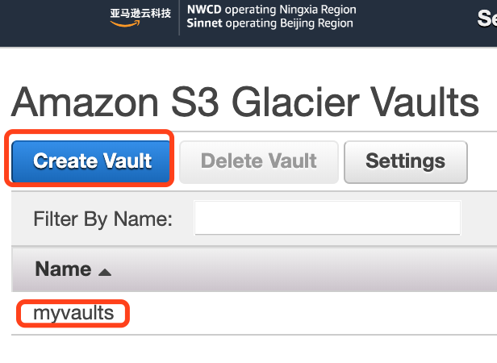
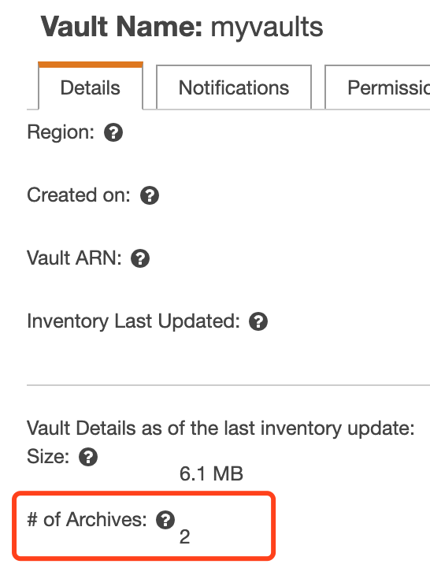
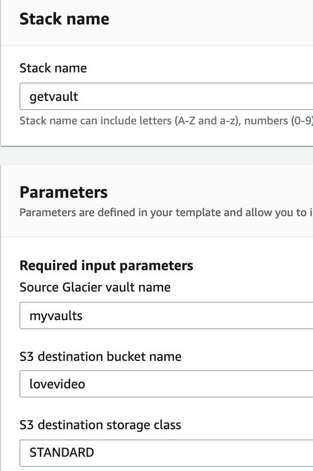
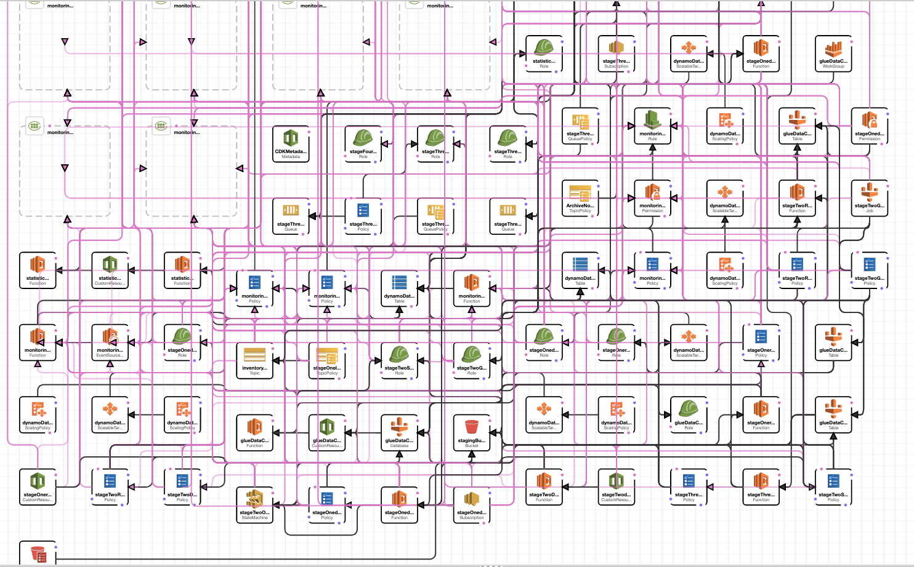

# 高阶18 使用cloudformation 自动提取Glacier Vaults 到 S3

> 说实话，这个标题相当的绕，初学者估计都不知道在讲什么，先别急，先看使用场景是不是适合你，再
> 决定自己需不需要看下去吧。
> -- D.C


### 基本概念

首先理解一下基本概念：

- Glacier Vaults，是和S3独立的一个产品，一个存储容器称之为一个Vaults，里面存的是archive，每个region最多可以建1000个，拥有属于自己的一套API命令集合，存储价格比s3 标准便宜，取回费用要贵且耗时，很大一个区别是，Vaults只能用api操作，而S3可以通过console界面去看（list）对象和操作。
- S3，对象存储服务，我们超过90%的数据都会放在这上面。
- S3 Glacier + Deep Archive，S3上的归档和深度归档服务，使用的是console界面或是aws cli命令进行归档和恢复。
- CloudFormation, 简称cf，是代码即基础设施的服务，我们常说的一键部署，就是利用这个服务，因为aws的服务都是api标准化接口的，所以完全可以通过xml或json格式的文件，把部署基础设施的步骤写进去，做到一键部署。

如何理解？Glacier有两种数据概念，一种是Vaults，另一种一种是Archive。简单来说， object（文件）--[归档]-> archive --[集合]--> Vaults。 Vautls是便于存放管理不同archive集合的容器。

### 如何使用vaults

#### **创建一个Vaults**

在主控制台搜索 **Glacier** 就可以找到对应界面，然后点击 Create Vaults就能创建多个Vaults。



或者，用 [sdk](https://docs.amazonaws.cn/en_us/amazonglacier/latest/dev/creating-vaults.html) 支持Java,.Net,REST,CLI。

#### **上传数据**

可以使用 AWS CLI 或者SDK。[示例教程](https://docs.aws.amazon.com/zh_cn/cli/latest/userguide/aws-cli.pdf#cli-services-glacier)

注意，上传以后，我去console是看不到有文件的，因为Vaults一天刷新一次，所以要过段时间才能看到下面有多少个archive。



#### **检索数据**

其实是检索 metadata, [文档](https://docs.amazonaws.cn/en_us/amazonglacier/latest/dev/retrieving-vault-info.html)

```
aws glacier describe-vault --vault-name awsexamplevault --account-id 111122223333
```

#### **恢复数据到本地**

参考 [文档](https://docs.amazonaws.cn/en_us/amazonglacier/latest/dev/retrieving-vault-inventory-cli.html)

```
$ aws glacier initiate-job --vault-name awsexamplevault --account-id 111122223333 --job-parameters '{"Type": "inventory-retrieval"}'

$ aws glacier describe-job --vault-name awsexamplevault --account-id 111122223333 --job-id *** jobid ***

{
    "InventoryRetrievalParameters": {
        "Format": "JSON"
    },
    "VaultARN": "*** vault arn ***",
    "Completed": false,
    "JobId": "*** jobid ***",
    "Action": "InventoryRetrieval",
    "CreationDate": "*** job creation date ***",
    "StatusCode": "InProgress"
}		
```

#### **恢复数据到S3**（数据不出云）

这里其实就是本文的 **重点** 了，会用到 cloudformation的一键部署。具体步骤如下

- 海外区域用这个[模板](https://aws.amazon.com/cn/solutions/implementations/amazon-s3-glacier-refreezer/)。
- 国内区域用这个[模板](../codes/amazon-s3-glacier-refreezer-cn.template)
- 在console界面打开cloudformation,点击右上角的 **创建堆栈-with new resources**


- 依次选择 *Template is ready* - *Upload a template file* - *choose file* , 选中模板，点击下一步。
- 设定堆栈名称 `getvault`, 数据源Vault `myvaults`, 要恢复到的目标S3桶 `lovevideo`,取回模式默认是 *Bulk*，底下的 *Confirmation to avoid excessive costs* 可以全部选 `Yes`,根据自己情况设置。



- 由于恢复出来的文件名默认是GlacierArchiveID，长这样 `WVfrXME2KC6JIedfadJF937412-e`, 在最后一个Option选项 *[OPTIONAL] External filenames override for ArchiveDescription* 这里可以指定S3上存放的ArchiveID和文件名的对应关系，从而直接恢复成human readable的文件名，参考[文档](https://docs.aws.amazon.com/zh_cn/solutions/latest/amazon-s3-glacier-refreezer/creating-custom-file-names-for-s3-objects.html)

```csv
GlacierArchiveID,FileName
WVfrXME2KC6JIedfadJF937412-e,mydata1.txt
yLam5H76JXYSKKIY34404D-Kwcrk,myfolder/mydata2.txt
...
```

- 点击下一步，设置Tag，如果有cloudformation的iam role，这里就选择一下，比如我的叫 `rolecfall`,因为懒我给它的policy其实就是 `AdministratorAccess`。如果没有cf的role的话，系统会自动依据你登录的这个账号权限进行部署，所以如果自己不是admin权限，最好让管理员建个 cloudformation的IAM role。
- 下一步，review没问题，选择确认框，点击 **Create Stack** 开始部署自动恢复堆栈，大约几分钟。
- console里转到cloudwatch界面，点击左侧的 *Dashboards*, 可以看到刚刚创建的堆栈 *getvault-Amazon-S3-Glacier-ReFreezer*， 点进去就能看到对应的 *dashboard* 信息。由于恢复Vaults是需要很长时间的，后面就要耐心等待了。

### 庞大的集成能力

最后不得不感叹下AWS服务的强大集成能力，严格而标准的API接口，使得规模化的服务集成成为可能，而且还要保证稳定性，从这一点上看，目前市面上还没有出现够格的挑战者。让我们欣赏下这个cf模板背后“庞大”的结构。 *这个庞大只是针对我这种小白来说，在真正的高科技企业内部，也许连渺小都不够格。*




> 躬身入局，胜过摇旗呐喊千倍万倍。
